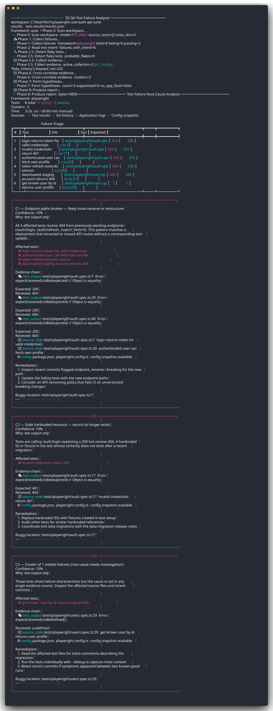

<div align="center">

# 🩻 ai-test-failure-analyzer

---

**Root cause in seconds. Evidence, not intuition.**

Feed it a **real** test result file — Playwright, Jest, Cypress, Newman, k6, or JUnit —
and it traces back through your **real** git history, application logs, and config
to surface the **actual** root cause, with a cited evidence chain and `file:line` precision.
No guesses. No fixture noise. No repeating the obvious.

[](https://github.com/aks-builds/ai-test-failure-analyzer/actions/workflows/ci.yml)
[](https://github.com/aks-builds/ai-test-failure-analyzer/actions/workflows/codeql.yml)
[](https://www.npmjs.com/package/ai-test-failure-analyzer)
[](https://pypi.org/project/ai-test-failure-analyzer)
[](LICENSE)
[](https://modelcontextprotocol.io)
[](skills/ai-test-failure-analyzer/SKILL.md)

<!-- HERO-START -->

<!-- HERO-END -->

🩻 A real analysis — evidence from `git`, `app.log`, and `.env` — no guesses, no fixture noise.

</div>

---

## Why ai-test-failure-analyzer

Manual test failure investigation takes 30–60 minutes: open the test output, grep through logs, dig through git history, check recent deploys, ask Slack. And you can still point at the wrong thing — especially when the test file itself has an "intentional failure" comment or a fixture designed to trigger the analyzer.

This tool does it automatically in seconds:

- Parses the test result file to extract failing tests with HTTP details
- Scans git history for high-risk commits (endpoint renames, migrations, auth changes)
- Scans application logs for ERROR/FATAL lines
- Reads config files (.env, docker-compose)
- Cross-correlates all evidence into clusters
- Forms ranked, evidence-cited hypotheses with `file:line` precision
- Never points to test fixtures or "intentional failure" comments as root causes

## How it's different

| | ai-test-failure-analyzer | Manual triage | Generic LLM |
|---|---|---|---|
| Evidence source | Real git/logs/config | Human memory | Training data |
| Fixture noise | Blocked by Tier-1 gate | No protection | No protection |
| `file:line` precision | ✅ | Sometimes | No |
| Works without source code | ✅ API-only mode | ✅ | ✅ |
| Repeatable | ✅ | ❌ | ❌ |
| CI-integrated | ✅ | ❌ | ❌ |

## Supported frameworks

| Framework | Format | Command |
|---|---|---|
| Playwright | JSON reporter | `playwright test --reporter=json` |
| Jest / Vitest | JSON | `jest --json --outputFile=results.json` |
| Cypress | Mochawesome JSON | `cypress run --reporter mochawesome` |
| pytest | JUnit XML | `pytest --junit-xml=results.xml` |
| Newman (Postman) | JSON | `newman run col.json --reporters json --reporter-json-export results.json` |
| k6 | Summary JSON | `k6 run --summary-export=results.json script.js` |
| REST Assured | JUnit XML | standard Maven Surefire output |
| Any JUnit-compatible | XML | TestNG, Karate, Insomnia CLI |

## Install

**npm (global — JS/CI devs):**
```bash
npm install -g ai-test-failure-analyzer
ai-analyze analyze playwright-report.json
```

**npx (zero install):**
```bash
npx ai-test-failure-analyzer analyze playwright-report.json
```

**pipx (Python devs):**
```bash
pipx install ai-test-failure-analyzer
analyzer analyze playwright-report.json
```

**Claude Code skill:**
```
/plugin install ai-test-failure-analyzer
```

**Install skill to all agents (Claude, Cursor, Codex, Gemini, Windsurf):**
```bash
ai-analyze install
```

**Docker:**
```bash
docker run --rm -v $(pwd):/workspace \
  ghcr.io/aks-builds/ai-test-failure-analyzer \
  analyze /workspace/results.json
```

## Usage

### CLI

```bash
ai-analyze analyze results.json
ai-analyze analyze results.json --mode api-only    # force API-only (no source scan)
ai-analyze analyze results.json --out report.md    # write report to file
ai-analyze analyze results.json --create-issue     # file GitHub issue for top hypothesis
```

### MCP server (Claude Code / Cursor)

Add to your MCP config:
```json
{
  "mcpServers": {
    "ai-test-failure-analyzer": {
      "command": "ai-analyze",
      "args": ["serve-stdio"]
    }
  }
}
```

Then ask Claude: *"Analyze the failures in playwright-report.json"*

### MCP HTTP (OpenAI / Gemini)

```bash
ai-analyze serve-http --port 8765
```

## API-only mode

No source code? No problem. When your workspace has no `src/`, `app/`, `lib/`, or `api/` directory — or when you pass `--mode api-only` — the tool switches to API-only mode.

It analyzes HTTP contract evidence directly from the test results:

```bash
ai-analyze analyze newman-results.json
# > API_ONLY mode — no workspace source detected, analyzing HTTP contract only
# Root Cause [95%] — POST /api/clips → 404 Not Found
#   Endpoint moved or removed. Check API changelog or versioning.
#   Evidence: response status 404 + URL /api/clips
```

Supports Newman, k6, Playwright (API tests), Jest, and any framework that records HTTP status codes.

## CI integration

```yaml
# .github/workflows/analyze-failures.yml
- name: Analyze test failures
  if: failure()
  run: |
    npx ai-test-failure-analyzer analyze test-results/results.json \
      --non-interactive \
      --out failure-analysis.md
- uses: actions/upload-artifact@v4
  if: failure()
  with:
    name: failure-analysis
    path: failure-analysis.md
```

## Security

- **No shell injection**: all subprocess calls use explicit argument lists
- **Path traversal protection**: all paths resolved relative to workspace root
- **Size caps**: 5 MB/file, 50 MB/scan, 200 commits max
- **Secrets redacted**: `.env` token/secret/key/password values masked in reports
- **No outbound network** from core analysis (GitHub issue creation is opt-in)

See [SECURITY.md](SECURITY.md) for the full threat model.

## Repository layout

```
analyzer/                   Python package (MCP server + CLI + analysis)
  parsers/                  Framework parsers (Playwright, Jest, Cypress, Newman, k6, JUnit)
  evidence/                 Evidence collection (git, logs, config)
  render/                   Report rendering (Markdown, ANSI)
  ui/                       User interfaces (CLI, TUI, Web)
  workspace_scanner.py      Phase 0 — mode detection, noise path discovery
  noise_filter.py           Evidence filtering and hypothesis deduplication
  orchestrator.py           8-phase analysis pipeline
  hypothesis.py             Confidence scoring and hypothesis formation
bin/cli.js                  Zero-dep Node wrapper (ai-analyze command)
skills/ai-test-failure-analyzer/SKILL.md  Claude Code agent skill
.claude-plugin/             Claude marketplace manifests
tests/analyzer/             pytest test suite
.github/workflows/          CI/CD (ci, release, publish, codeql)
```

## Testing

```bash
pytest tests/analyzer -q    # Python: parsers, correlator, noise filter, workspace scanner
npm test                    # Node: CLI smoke tests
```

## Contributing

See [CONTRIBUTING.md](CONTRIBUTING.md).
